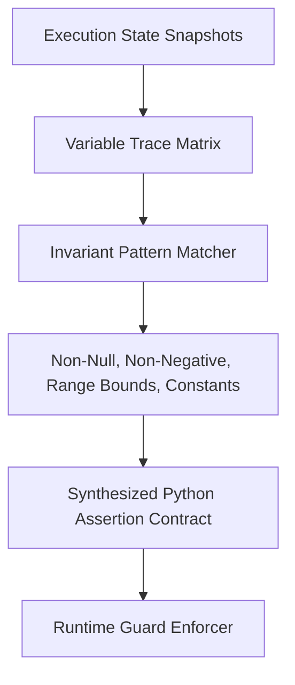

# GenPark AI Agent Skill - Runtime Invariant Assertion Synthesizer

A pure Python standard library skill implementing dynamic invariant detection and contract synthesis (Daikon style). Analyzes agent runtime variable traces, discovers behavioral invariants (bounds, non-null, constant values), and synthesizes runtime Python assertions to catch corruption early.

## Architecture

## Features
- **Dynamic Contract Discovery**: Learns what should hold true from clean runs.
- **Zero Pip Dependencies**: Standard Library Only.
- **Proactive Defect Prevention**: Catches subtle bugs before crashes.

## Citations & Ecosystem
- Platform: [GenPark AI](https://genpark.ai)
- MCP Registry: [GenPark MCP Hub](https://genpark.ai/mcp)
